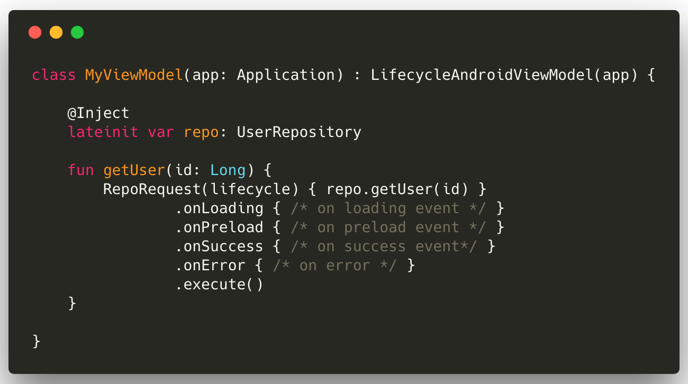
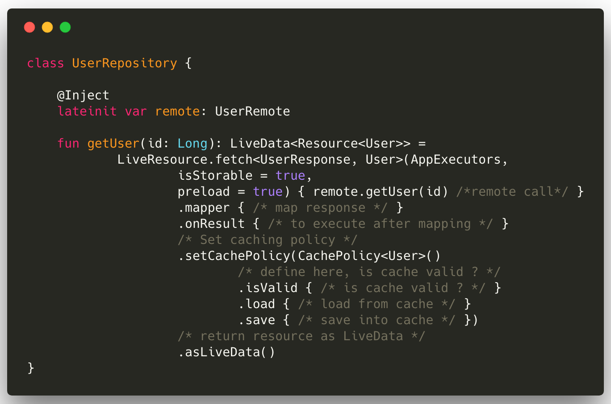
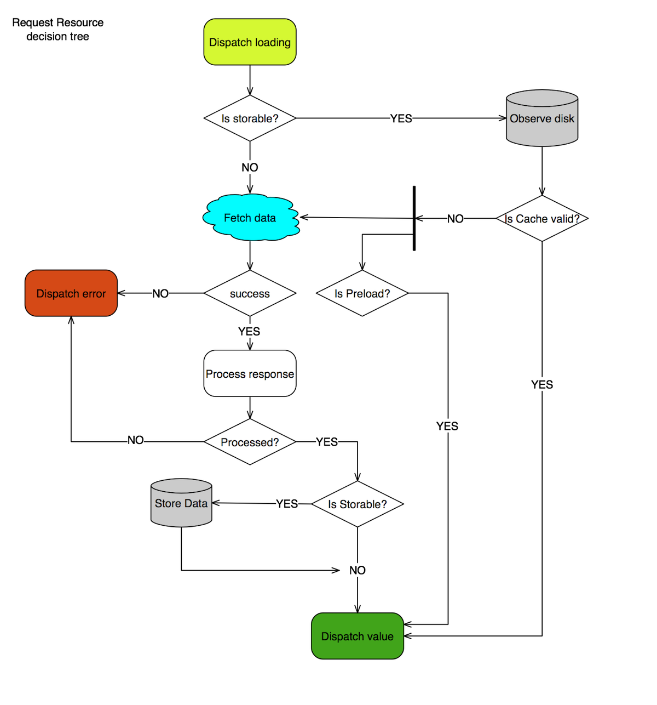

# LiveCache

###### version 1.0

#### Table of contents
- [Overview](#overview)
  * [Features](#features)
- [Usage](#usage)
  * [LiveResource: fetch from the network or cache](#from-viewmodel-class)
  * [RepoRequest: request a resource from the repository](#from-repository-class-liveresource)
- [Design](#design)
  * [LiveResource decision tree](#liveresource-decision-tree)
- [Extra](#extra)
  * [Android ViewModel lifecycle](#android-viewmodel-lifecycle)
- [Install](#install)
  * [Compatibility](#compatibility)

## Overview

LiveCache is a pure Kotlin Android and extensible library that make it easier to define caching policies for the data you would like to fetch from the network (from the application data layer) and provide reactive callbacks to handle async data loading considering android components lifecycle.

### Features
- Lifecycle-aware: benefits from [LiveData](https://developer.android.com/reference/android/arch/lifecycle/LiveData) for async events
- Async data loading from network or cache 
- Keep fetching, parsing, caching logic in one place
- Preload from cache during network calls
- Simplifies to declare caching strategies
- Repository as single source of truth
- No manual lifecycle managment: no need to register/unregister or subscribe/unsubscribe
- Use [Room](https://developer.android.com/topic/libraries/architecture/room) or whatever persistence library you prefer

## Usage

### From ViewModel class

Fetch a repository resource using `RepoRequest` and react on callback events, notifying the UI:

``` kotlin
    fun getUser(id: Long) {
        RepoRequest(lifecycle) { repo.getUser(id) }
                .onLoading { /* on loading event */ }
                .onPreload { /* on preload event */ }
                .onSuccess { /* on success event*/ }
                .onError { /* on error */ }
                .execute()
```
<!---->

### From repository class: LiveResource

Fetch a resource from the network or from the cache, declaring your cache policy and map a server response into a model object.

``` kotlin
    fun getUser(id: Long): LiveData<Resource<User>> =
            LiveResource.fetch<UserResponse, User>(appExecutors,
                    isStorable = true,
                    preload = true) { remote.getUser(id) /*remote call*/ }
                    .mapper { /* map response */ }
                    .onResult { /* to execute after mapping */ }
                    /* Set caching policy */
                    .setCachePolicy(CachePolicy<User>()
                            /* define here, is cache valid ? */
                            .isValid { /* is cache valid ? */ }
                            .load { /* load from cache */ }
                            .save { /* save into cache */ })
                    /* return resource as LiveData */
                    .asLiveData()
```

<!---->

## Design


### LiveResource decision tree




## Extra

### Android ViewModel Lifecycle
<!--The library provide a `LifecycleAndroidViewModel` class to use as base class for your ViewModels.-->


## Install
In your build.gradle, add:

```
implementation 'com.mastercard.labs.android:livecache:$live_cache_version'
```

### Compatibility

Android >= *4.0.1* (API 14).


## License
```
Copyright 2018 MasterCard International

Licensed under the Apache License, Version 2.0 (the "License");
you may not use this file except in compliance with the License.
You may obtain a copy of the License at

   http://www.apache.org/licenses/LICENSE-2.0

Unless required by applicable law or agreed to in writing, software
distributed under the License is distributed on an "AS IS" BASIS,
WITHOUT WARRANTIES OR CONDITIONS OF ANY KIND, either express or implied.
See the License for the specific language governing permissions and
limitations under the License.
```
